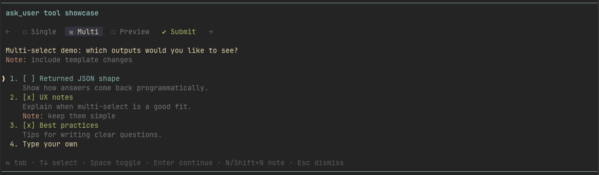
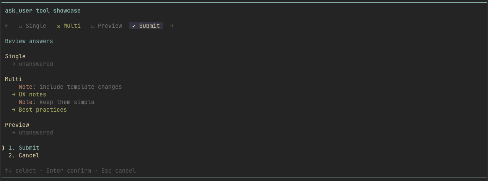

# @eko24ive/pi-ask

`@eko24ive/pi-ask` adds an interactive `ask_user` clarification tool.

It lets an agent pause, ask structured questions in a terminal UI, and continue with normalized answers instead of guessing.

<video src="docs/media/ask-user-demo.mp4" controls muted playsinline width="900">
  Your browser does not support embedded video playback.
</video>

## Install

```bash
pi install npm:@eko24ive/pi-ask
```

You can also install from git:

```bash
pi install git:github.com/eko24ive/pi-ask
```

### Screenshots

| | |
| --- | --- |
|  |  |
|  |  |

## Features

Once installed, this package gives the agent a native way to ask for clarification instead of guessing.

- 🧭 **Multi-question flow** — gather several answers in one pass.
- ✅ **Single + multi select** — support simple and additive choices.
- 🪟 **Preview mode** — show richer options with a dedicated preview pane.
- ✍️ **Custom answers** — users can choose `Type your own` and type inline.
- 📝 **Notes** — add question-level or option-level context without breaking the flow.
- 👀 **Submit screen** — check everything before submitting answers back to the agent.
- ⌨️ **Fast keyboard UX** — number shortcuts, inline selection, notes, and submit navigation.

## Use

After installation, the package registers one tool: `ask_user`.

That is enough for the agent to gain this clarification capability. The extension already injects prompt guidance that encourages the agent to call `ask_user` when requirements are ambiguous or user preference matters, instead of guessing.

You can still add your own agent instruction if you want to further reinforce when and how the tool should be used.

Use `type: "preview"` when an option needs a dedicated preview pane.

### Optional extra agent instruction

```text
If you need clarification, prefer `ask_user` over guessing.

Ask 1-3 concise questions.
Use short tab labels.
Prefer 2-4 options per question.
Include descriptions for each option.
Use `type: "single"` unless multiple options can genuinely apply.
Use `type: "multi"` only when the user may need to select several answers.
Use `type: "preview"` when an option needs a preview panel.
After answers are returned, continue the task using those answers explicitly.
```

## Tool input

`ask_user` accepts:

```ts
{
  title?: string,
  questions: [
    {
      id: string,
      label?: string,
      prompt: string,
      type?: "single" | "multi" | "preview",
      required?: boolean,
      options: [
        {
          value: string,
          label: string,
          description?: string,
          preview?: string
        }
      ]
    }
  ]
}
```

### Example tool call payload

```json
{
  "title": "Implementation preferences",
  "questions": [
    {
      "id": "style",
      "label": "Style",
      "prompt": "How should I frame the next prompt?",
      "type": "single",
      "options": [
        {
          "value": "minimal",
          "label": "Minimal",
          "description": "A short, direct question with few options."
        },
        {
          "value": "balanced",
          "label": "Balanced",
          "description": "A standard prompt with a bit more context."
        },
        {
          "value": "rich",
          "label": "Rich",
          "description": "A more descriptive prompt with extra detail."
        }
      ]
    },
    {
      "id": "frameworks",
      "label": "Frontend",
      "prompt": "Which frontend frameworks have you used?",
      "type": "multi",
      "options": [
        { "value": "react", "label": "React", "description": "Most popular UI library" },
        { "value": "vue", "label": "Vue", "description": "Progressive framework for building UIs" },
        { "value": "svelte", "label": "Svelte", "description": "Compiler-based approach" }
      ]
    }
  ]
}
```

## Returned result

The returned `details.answers[questionId]` object may include:

```ts
{
  values: string[]
  labels: string[]
  indices: number[]
  customText?: string
  note?: string
  optionNotes?: Record<string, string>
}
```

Behavior details:

- question-level notes are submitted whenever authored
- option notes can be authored for any active option during the UI flow
- only notes for currently selected options are included in the submitted result
- deselecting an option keeps its note in UI state, so re-selecting it restores the note
- empty note text clears the note
- on multi-select questions, saving a free-form answer keeps other selected options intact
- on multi-select questions, submitted `values` and `labels` include both selected options and the free-form answer when both exist
- when the free-form option is selected, it becomes an inline input row with the selected-tab background style spanning the full width
- while editing a note or free-form answer, arrow keys and `Tab` stay inside the editor so the typing cursor can move naturally
- free-form answer editors support pi-style `@` file path autocomplete for quickly mentioning project files
- `Esc` closes the editor and returns to navigation mode
- `Ctrl+C` dismisses the entire ask flow immediately, even from note/free-form editing, without saving the current draft
- `Space` toggles the active option on single-select questions too, but does not auto-advance

## Local development

### Run locally in pi

```bash
pi -e ./src/index.ts
```

### Install dependencies

```bash
pnpm install
```

### Development commands

```bash
pnpm format
pnpm lint
pnpm check
pnpm typecheck
pnpm test
```

### Commit workflow

This repo uses `lefthook`, Commitizen, conventional commitlint, and semantic-release.

Recommended flow:

```bash
pnpm commit
```

## Project layout

- `src/` — TypeScript extension implementation
- `tests/` — behavior-focused tests
- `docs/` — small docs set for contract and architecture
- `docs/media/` — repository-only README media assets

## Documentation

Docs stay intentionally small:

- `docs/README.md` — index
- `docs/contract.md` — external behavior
- `docs/architecture.md` — module boundaries and invariants
